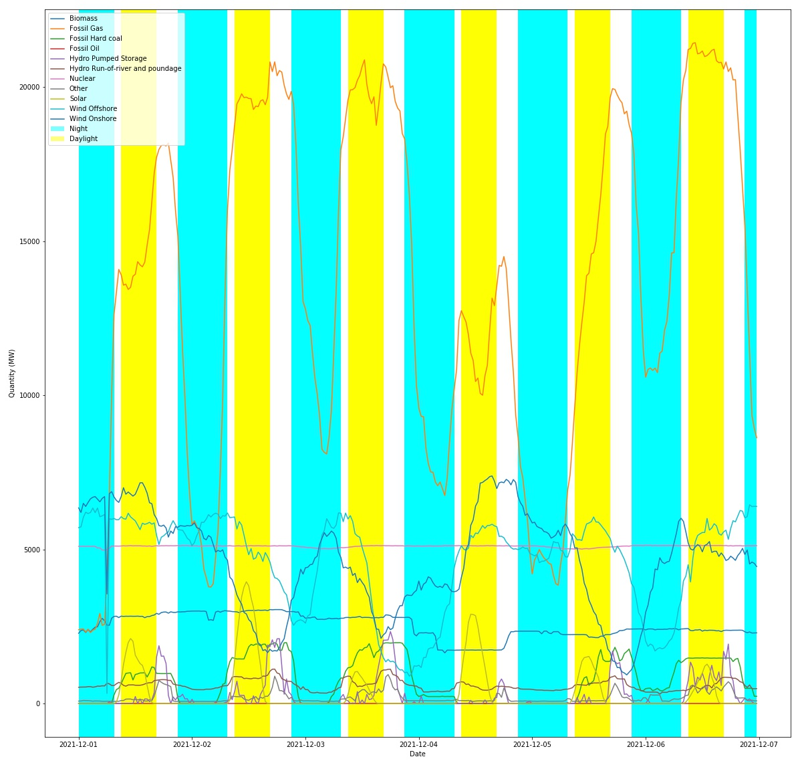

# Elexon Data Portal
Examples of accessing [BMRS](https://www.bmreports.com/bmrs/) data using the third-party [Elexon Data Portal python library](https://github.com/OSUKED/ElexonDataPortal).

# API Key

To make requests to the BMRS service an account and API key is required - see the [documentation](https://www.elexon.co.uk/documents/training-guidance/bsc-guidance-notes/bmrs-api-and-data-push-user-guide-2/).

Once you have your API key, set this to the environment variable `ELEXON_API_KEY`. You can use [direnv](https://direnv.net/) to set this for you automatically - copy the `envrc_template` to `.envrc` and fill in the blank. Ensure you never commit your key to the public repo.
